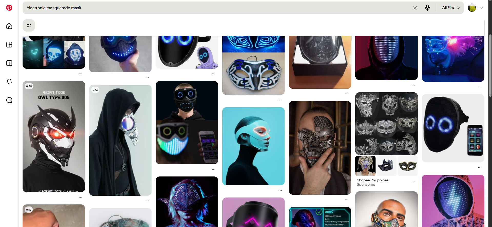
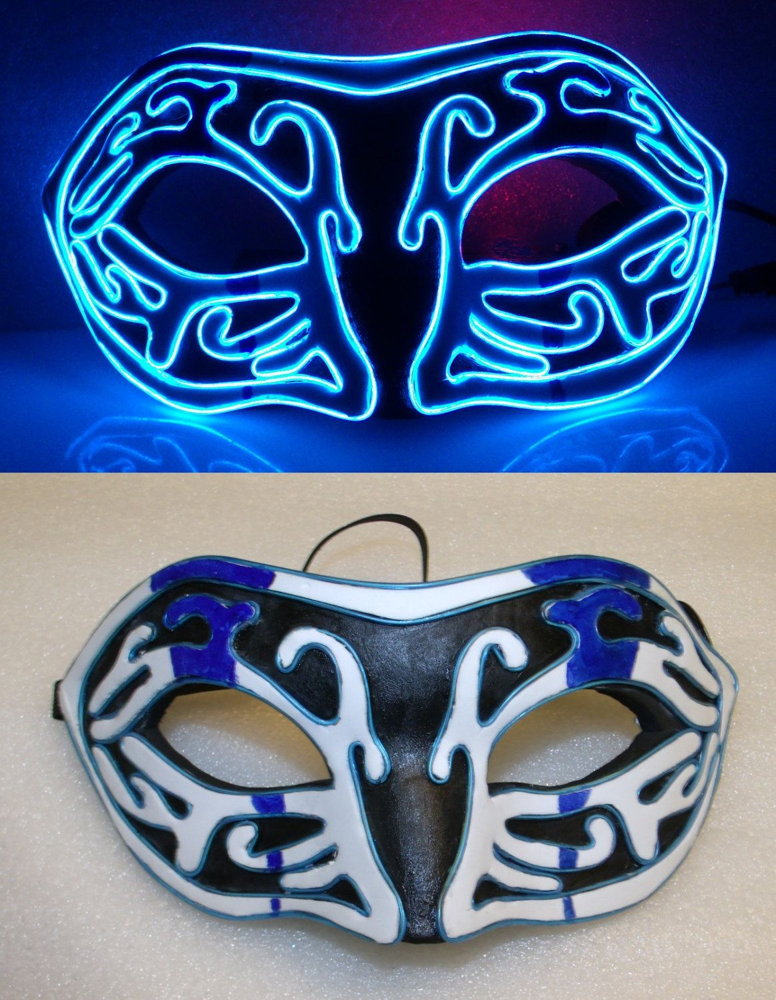
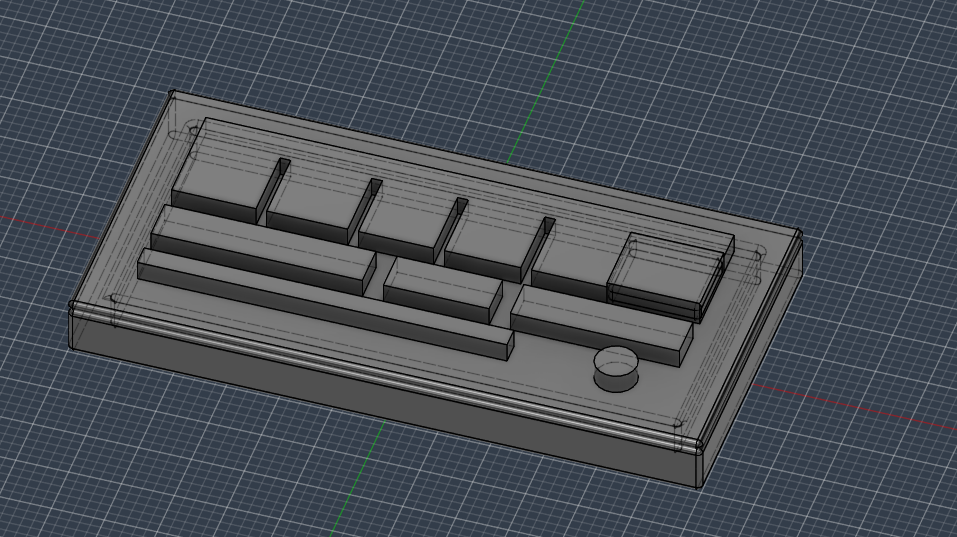

| Date started: March 26, 2026

## March

# Entry 0 - 04-04-26: BRAINSTORMING

Since my prom is in a month, I had an idea to make an electronic mask that would be so cool to wear during prom. I would also give this to my prom date, and both of us will have the best aura in prom! How cool is that?

So now, I think I've gotten a rough idea of how this will work:

Let's first think of a regular masquerade mask. It simply has design on a base mask. So we'll need to find a base mask. So there's this physical store that sells a mask in an area. We'll try looking over there and see if there are any base masks we can use and then we can mount up our LEDs.

Another alternative is that we 3D print these masquerade masks. I'm just not sure if it'll arrive on time. I think it's definitely an option. I just need to get it done within a reasonable time then we'll be all goods.

Of course, to look aura, we'll need to have LEDs and other accessories.

However, that begs the question. What type of LEDs? LED strips? what color? I'll try to answer that in my next journal.

Total hours spent: 0.2 hours

# Entry 1 - 04-05-26: BRAINSTORMING part 2

Alright, we didn't quite flourish the brainstorming last session so I'll finish it with this journal.

So we know that we need:
- A base mask (I can try to 3d print this one)
- A LED
- A coin cell battery (really small)
    - Maybe this module from adafruit would work
    https://www.adafruit.com/product/1871
- Perhaps other sensors like accelerometers to make this project much cooler

So let's try digging in to the LED

I kinda wanna do something like this:

Like with the electroluminescent wire and all.

Thus, let's go try to find an electroluminescent wire. I mean, in the first place, what the hell is an electroluminescent wire?

The difference between an electroluminescent wire and a LED strip is that:
- LED strips arem uch briger, durable, and versatile for accent lighting
- On the otherhand, EL wires are great for artistic purposes to add a dim, neon-like glow 

According to various comparisons, EL wires win by a margin because it fits the shape of the mask perfectly.

Okay, so apparently, the EL wire, when bought with a kit, doesn't need anymore external power source as it has its own AC inverters to keep it alive. That is pretty convenient on its own.

However, an EL wire itself would make the mask still boring. Hence, why not add more features?

Yeah, but honestly, before that, let's get the 3D design rolling first. But honestly, just buying a base mask is a better option. So, of course, we need to add gimmicks to the mask so that it at least can be different.

Some gimmicks I can think of?
- A sound sensor to sync w the beat?
- 

Okay but anyways, here's the summary:
- We're going to be using an electroluminescent wire w a battery controller so that wiring does not get complicated
    - in order to add arduino into that system, we just need to make some changes in the battery controller
    - Keep in mind the the average battery controller for an EL wire is approx. 6cm x 3cm x 2cm
- Then, after that we can try to implement the gimmicks we thought of.
- Before that, we're going to 3d print the mask by having a fully custom 3d design

Okay, so since we're 3D printing it, the 3D model should have these features:
- Built-in wire routing: so that they automatically just snap in instead of glue
- A back compartment for the controller and other electronics
- Ventilation slots
- Custom fit using my actual face measurements

According to claude, here are the steps:
- Sketch the outline shape from the front view (my very own front view)
- Use the loft tool between a few profile curves to create the face curvature
- Use shell to hollow it and set wall thickness
- Cut eye holes with sketch + extrude cut
- Add mounting points for elastic/string
- Export STL

Alright! Let's get to making this, shall we?

Time spent: 1 hour

# Entry 2 - 04-06-26: Making the base mask

For this journal, I will be attempting to create the base mask in Fusion360.

So first thing I did was that I went into Thingiverse and Printables to find a base 3D mask model I could use in order for me to model the base. And so, by using the STL file of my base mask, I can cut out holes based on my face measurements. Also, I could customize it to fit my electronic components accordingly.

I think one of the best places to put my electronics in to make everything functional is to put like a side compartment on the mask. See the inspiration below.

That way, it kind of blends in with the mask by having a design to it. And at the same time, we could have extra functionalities and gimmicks of the mask by adding electronic components to do those.

Now, this begs the question:
- What design should the side compartment have?

I was thinking, differently for me and my date to have different masks. 

Hence, I am going to be creating two different designs for this one.

Total hours spent: 1 hour

# Entry 2 - 04-07-26: Making the side compartment from the base mask

Okay I js had the most genius idea ever. What if, instead of meshing together both the side compartment and the base mask, we make them separate and then just stick them together?

That way, I don't have to work with a curved surface and I could actually just model it (of course with measurements in mind). Hence, when I make a mistake, I can just 3D print the part instead of 3D printing the entire thing.

Okay, now to get on with the design.

For my mask I would like:
- Some sort of cyberpunk style (I'll find an inspiration for that) with all the electroluminescent wires

For her mask, I think she would like a cute style (maybe a lotus?)

Anyways attached below is the progress so far of the side compartment of mine. I'm not really too sure about the design yet. I'm trying to make it look like a cyberpunk type of style, but it just looks like a normal box tbh. 

Some ideas to make it better:
- Maybe a rectangular visor like Soldier 76

Anyways here's my progress so far. Its definitely worth consideration regarding the side compartment to be like Soldier 76's but I'll think about that and keep it at the back of my mind.

Next up: lotus flower design for my date!

Total hours spent: 1 hour