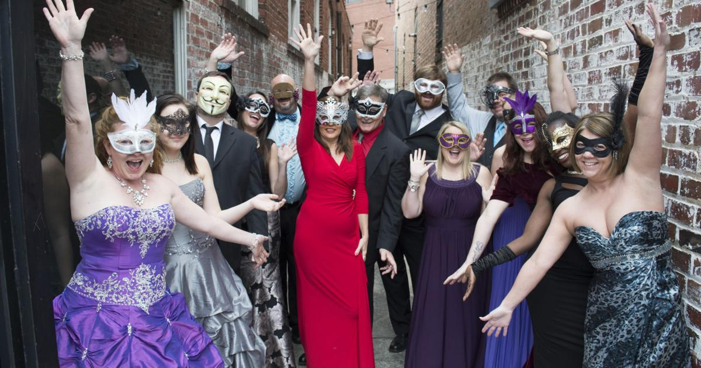
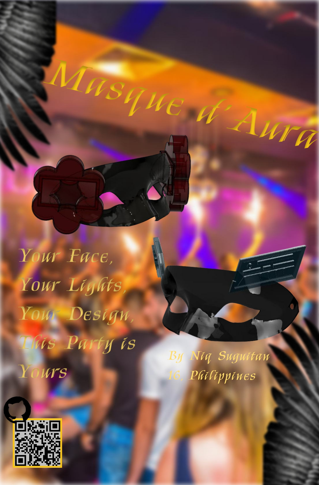
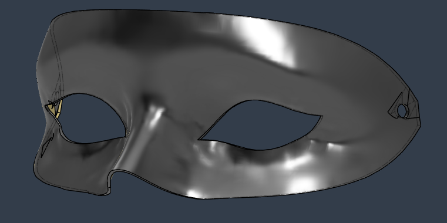
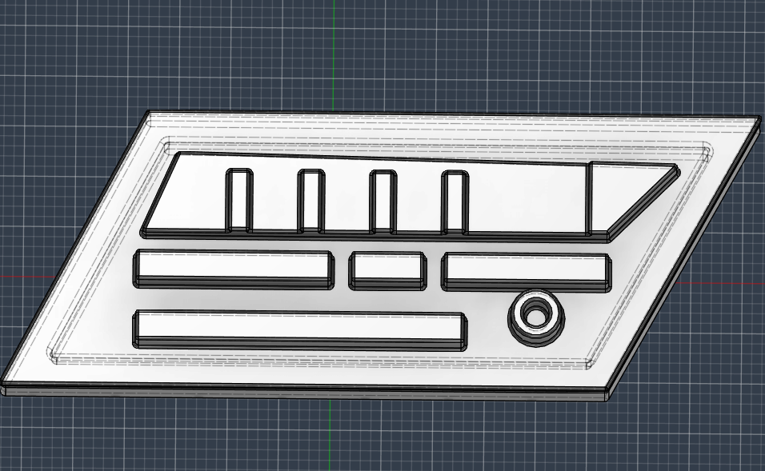
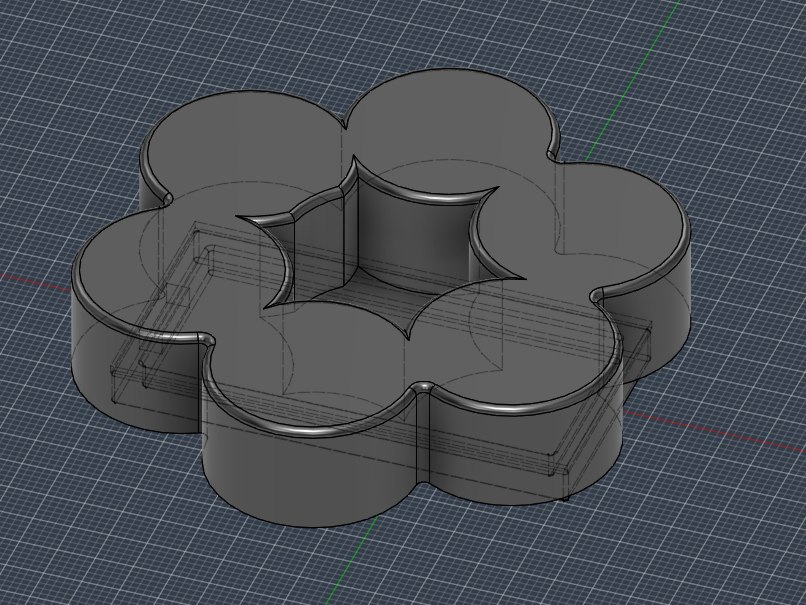
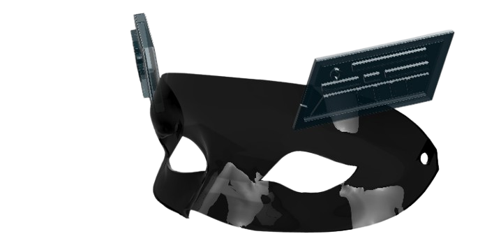
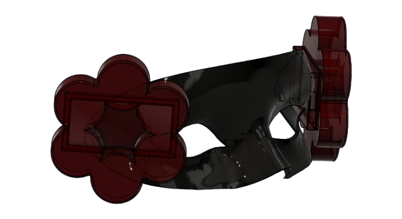

# Masque d'Aura 

## Project Aims

A little over 2 weeks ago (as of writing this), I had a crazy idea to be the most auraful person in the room in our prom. Not only the most auraful person but also the most AURAFUL DUO in the room. I asked my date if this was fine and she agreed! So here goes nothing.

Okay, about the project, it's basically just a mask with electroluminescent wires. Nothing more. Nothing Less. The electroluminescent wires will be attached on the front of the mask so that it would look cool in the dark. I've considered adding electronics into it, but I'd thought that it would be great to have a first draft before integrating the electronics. So I'll definitely get back to that. But anyways, since prom is a month away, we didn't wanna risk integrating electronics as it would take up time which could not make this project arrive in time for prom.

As for the CAD, I've found a base mask model to use so that we could attach our side compartments. Now, the side compartments are little designs housting our battery controller for the EL wires. This will also house the electronics if ever I decide to make it have electronics.

Anyways! That's pretty much it for now. More features will come once the 3D printed stuff slide into my house. I know it's a low effort one (probably the most low effort I've done which is crazy) but I've recently just been getting back into electronics and this is a great start!

## Zine Page

## CAD

### Base Mask

### Side Compartment 1 - Cyberpunk 

### Side Compartment 2 - Lotus

### Draft Design 1 - Cyberpunk

### Draft Design 2 - Lotus

Notice: No lights yet because I can't seem to find a way to add lights to Fusion360 while rendering.

## 3D Printing
3D Printing this will be through printing legion. The side compartments can be 3D printed using a normal FDM printer.

## BOM

## Support

For questions, suggestions, or collaborations, feel free to contact the engineer:

- Github: @Niqtan

- Slack User: @Niq

- Email: niqban123@gmail.com

Thank you for checking out Masque d'Aura